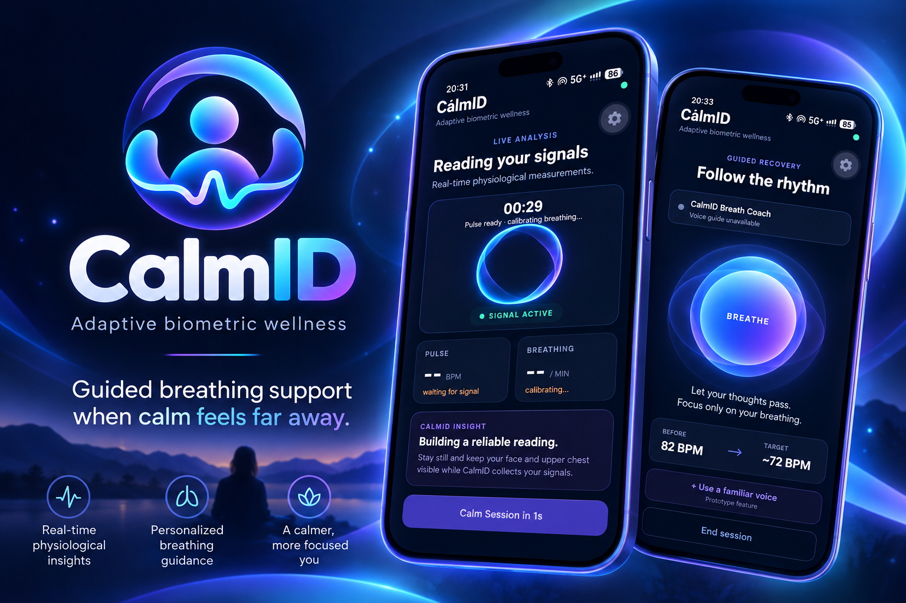

# CalmID

<p align="center">
  
</p>

<p align="center">
  <strong>Adaptive biometric wellness for guided breathing and calmer moments.</strong>
</p>

<p align="center">
  
</p>

## Overview

CalmID is an Android wellness app built during Hack the Hill. It combines guided breathing, camera-assisted biometric wellness signals, and calming voice support in a focused mobile experience.

The project started from a personal experience: helping a loved one through a panic episode over the phone by calmly guiding their breathing. CalmID explores how a mobile experience can recreate part of that feeling of presence and support when someone is far away.

> CalmID is a wellness demonstration and is not a medical diagnostic tool.

## Features

- **Biometric-assisted scan**
  - Front-camera framing flow
  - Presage SmartSpectra integration
  - Live framing feedback such as centering, motion, and positioning guidance
  - Pulse and breathing-related signals when available

- **Guided 4-1-6 breathing**
  - Inhale for 4 seconds
  - Hold for 1 second
  - Exhale for 6 seconds
  - Animated breathing orb and visual phase cues

- **Meditation-only mode**
  - Skip the biometric scan entirely
  - Start breathing guidance immediately
  - No biometric metrics are shown when no scan was performed

- **Voice guidance**
  - Local TTS fallback
  - French / English language toggle
  - ElevenLabs live voice coach integration

- **Familiar voice concept**
  - Prototype idea for future consent-based guidance using the voice of someone the user trusts

## Tech Stack

- React Native
- Expo
- TypeScript
- JavaScript
- Kotlin
- Expo Camera
- Expo Speech
- EAS Build
- Presage SmartSpectra SDK
- ElevenLabs
- LiveKit
- Git / GitHub

## Architecture

CalmID uses a hybrid React Native + native Android architecture.

The React Native layer handles the main UI, camera framing, breathing animation, meditation mode, language controls, and voice experience.

A custom local Expo module written in Kotlin bridges the app to Presage SmartSpectra for native biometric processing on Android.

The camera experience uses a handoff model:

1. Expo Camera acts as a front-facing mirror for framing.
2. The mirror is released.
3. Presage takes ownership of the camera for biometric processing.
4. Live validation feedback and available metrics are surfaced in the React Native UI.

This avoids running two competing camera pipelines at the same time.

## Project Structure

```text
CalmID/
├── App.tsx
├── app.json
├── eas.json
├── package.json
├── assets/
├── modules/
│   └── presage/
│       ├── android/
│       └── src/
└── docs/
    ├── calmid-logo.png
    └── calmid-cover.png
```

## Getting Started

### Requirements

- Node.js
- npm
- Expo CLI / EAS CLI
- Android device
- Expo development build

### Install dependencies

```bash
npm install
```

### Environment variables

Create `.env.local`:

```env
EXPO_PUBLIC_PRESAGE_API_KEY=your_presage_key
EXPO_PUBLIC_ELEVENLABS_AGENT_ID=your_elevenlabs_agent_id
```

Do not commit real secrets to GitHub.

### Start the development server

```bash
npx expo start --dev-client
```

### Build Android development client

```bash
eas build --platform android --profile development
```

## Demo Flow

### Biometric-assisted flow

```text
Start scan
→ front-camera mirror
→ framing
→ Presage analysis
→ live guidance + available metrics
→ guided breathing
```

### Meditation-only flow

```text
Just breathe
→ guided 4-1-6 breathing
→ local TTS or ElevenLabs voice
```

## Hackathon Challenges

Some of the hardest parts of the project were:

- integrating a native Android biometric SDK into Expo,
- resolving Kotlin / Gradle / Android SDK compatibility issues,
- handling Presage processing states,
- coordinating camera ownership between Expo Camera and Presage,
- stabilizing front-camera framing,
- and making voice guidance resilient when network services fail.

A major product lesson was that the breathing experience should remain useful even when biometrics or cloud voice services are unavailable.

## What We Learned

CalmID pushed us beyond a standard React Native application. We worked with native Expo modules, Kotlin, camera lifecycle management, real-time physiological signals, WebRTC-based voice communication, and graceful fallback design.

We also learned that for a wellness experience, reliability and simplicity matter as much as technical ambition.

## What's Next

- Improve biometric signal reliability
- Refine camera framing guidance
- Add richer offline / prerecorded voice guidance
- Expand bilingual support
- Explore consent-based familiar voice guidance
- Add saved breathing preferences and session history
- Improve privacy controls around biometric and voice data

## Stable Hackathon Release

Current stable hackathon release: **v1.0.0-hackthehill**

This release focuses on a reliable demo experience:
- biometric scan flow,
- meditation-only flow,
- bilingual breathing guidance,
- ElevenLabs live voice integration,
- local TTS fallback,
- and a polished Android UI.

## Disclaimer

CalmID is a wellness prototype. It is not intended to diagnose, treat, cure, or prevent any medical or mental health condition. If someone is in immediate danger or experiencing a medical emergency, they should seek appropriate professional help.
